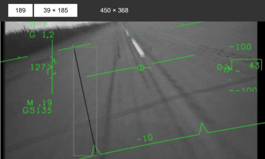
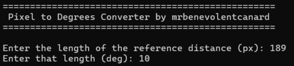
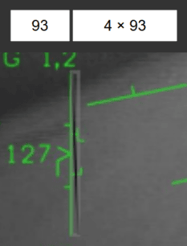
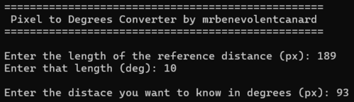

# Pixel_To_Degrees
  
This is just a little program I made in order to learn a bit of C++. It is used for converting pixels on a picture or drawning to degrees & milliradians to ease the process of making a HUD in DCS World. Note that this will work better the higher resolution the picture is.

## Usage
1. Open the .exe (or compile it yourself with the source code).
2. Measure the reference distance in pixels. This distance should be known in degrees. Example picture is between the horizon line and -10° pitch line (10° difference):  
3. Input the pixel and degrees length of the reference distance.  
4. Measure the length of the distance you want to know the length of in degrees. Example picture is the length of the speedtape:  
5. Input that length.  
6. Result is displayed as follows (in this case the length of the speedtape is probably 5°):  

#### I hope you find this simple program useful! :D
